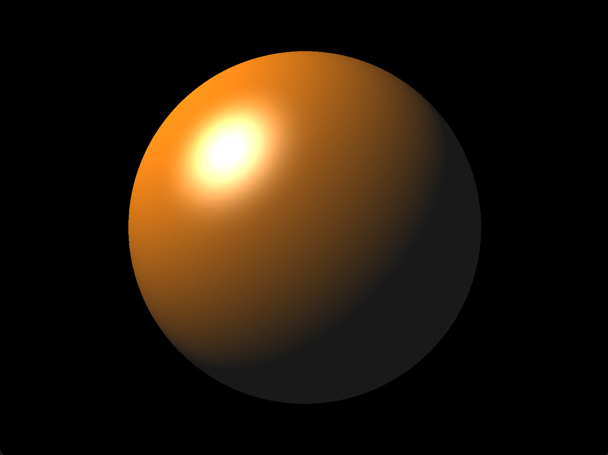
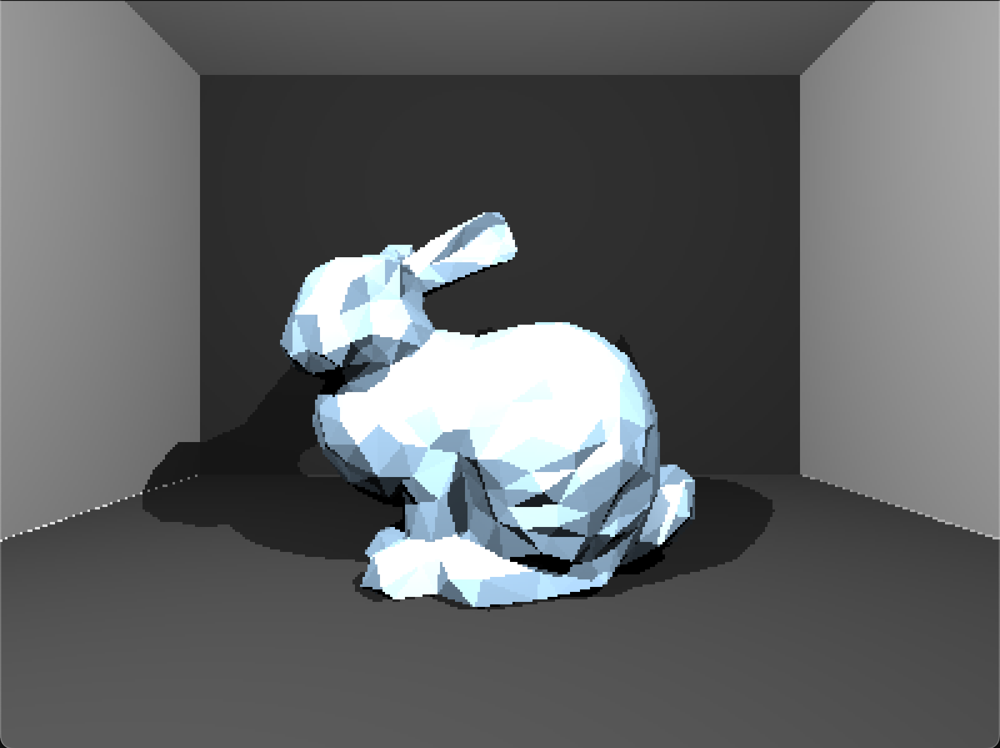
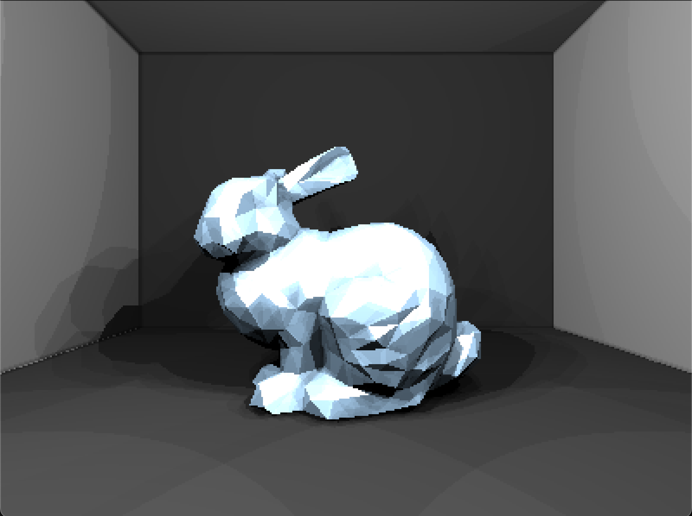
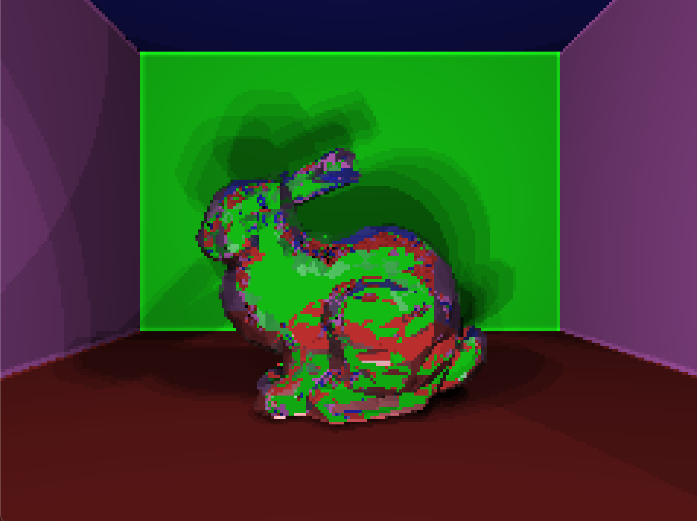
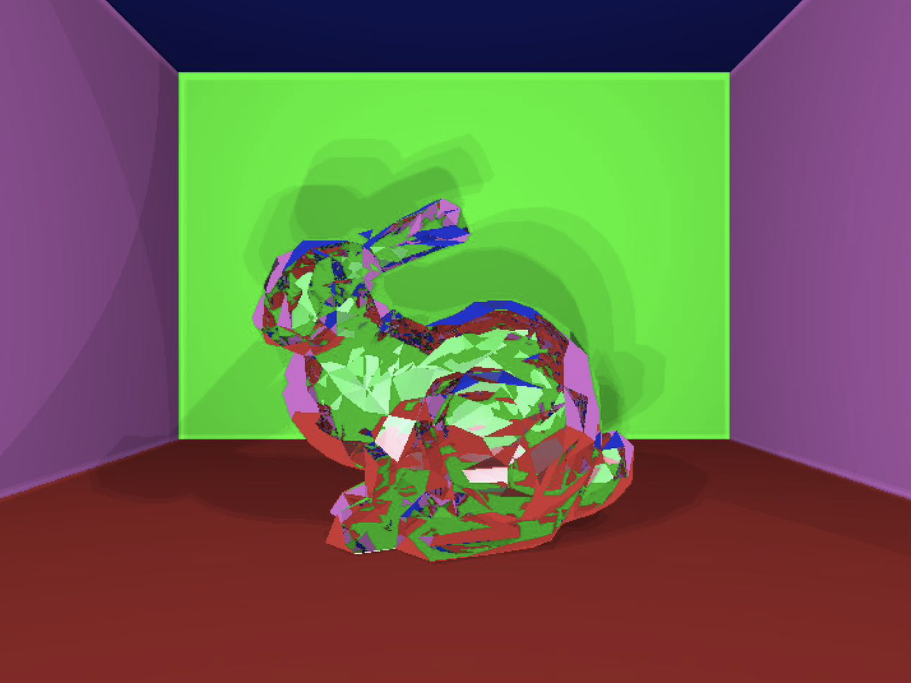

# Final Project Report and Result

## Part 1: Implement a sphere using texture in shaders.

 The vertex shader only draws a quad using two filling screen triangle. Then sphere description data are passing into fragment shader and everything is created in the fragment shader. The result also coporate basic phong shading. 

## Part 2: Using ray tracer to create the bunny we used for task 3 in shaders, adding planes, various light sources, and shadow.

 The approach is the same with above to create the bunny, however, vertices of all 1000 triangles are passed into the shader and create from there. Every fragment has to loop through all 1000 triangles to calculate intersection, phong shading, and shadow. 

 According to the limitations of my computer (Macbook Pro), the ray tracer only render 1 frame in 400 * 300, and then saved to a texture and passed to a different program with a larger window size.

## Part 3: Apply soft shadows to the rabbit by implementing area light.

 Implement area light and blurred edges by simulating a 3 * 3 grid to fill the screen and randomized light position in each gridbox. Better effects could be approached with a better computer by stimulating a larger grid. Same resolution as part 2 is used for part 3. 

## Part 4: Simulate a crystal rabbit by adding loops of reflection with a refraction index.

 Adding reflection with refraction index of 1.35 and a max hit of 12 to simulate a crystal made rabbit. The resolution has to be further decreased to 200 * 150 due to the hardware limitations. High resolution with larger hit depth is run on an advanced PC and the result is also presented. 

